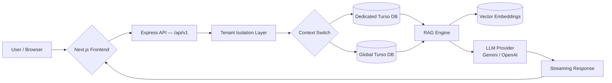

# 🛡️ Relmonition

> **Production-grade, multi-tenant relationship intelligence platform.**  
> Not just an LLM wrapper — a high-compliance, privacy-first system built for secure, persistent, and deeply personal AI-driven insights.

Live at **[relmonition.dpdns.org](https://relmonition.dpdns.org)**

---

## What Is Relmonition?

Relmonition is a relationship intelligence platform that helps couples understand their relationship patterns through AI-powered journaling, mood tracking, and behavioral analytics. It uses a **Hierarchical RAG (Retrieval-Augmented Generation)** system that builds a growing, persistent memory from a couple's journal entries and chat history — enabling an AI coach that genuinely *knows* them over time.

Built for scale and privacy from day one. Every couple is an isolated tenant. Their data never touches another tenant's compute or database.

---

## Architecture Overview

Relmonition is built on a **Three-Pillar Security Model**:

| Pillar | Description |
|---|---|
| **Strict Isolation** | Namespace-per-tenant on AWS EKS + dedicated Turso DB per couple |
| **Persistent Memory** | Hierarchical RAG (Vector + Semantic) that grows with the relationship |
| **Immutable Auditing** | HIPAA/GDPR-aligned compliance labels on every namespace |

### Infrastructure & CI/CD Topology


### Tenant Data Flow & Auth Lifecycle


### Request Data Flow



---

## Tech Stack

### Frontend

| Technology | Version | Role |
|---|---|---|
| **Next.js** | 16 (App Router) | SSR, routing, page shell |
| **React** | 19 | UI component framework |
| **Tailwind CSS** | v4 | Utility-first styling |
| **Radix UI** | Latest | Accessible headless components |
| **Motion** | 12 | Animations & transitions |
| **Recharts** | 2 | Relationship health graphs |
| **React Hook Form** | 7 | Form state management |
| **Sonner** | 2 | Toast notifications |
| **react-markdown** | 10 | Streaming AI response rendering |

### Backend

| Technology | Version | Role |
|---|---|---|
| **Node.js / Express** | Latest | REST API server |
| **TypeScript** | 6 | Type-safe service architecture |
| **Drizzle ORM** | Latest | Edge-compatible, type-safe SQL |
| **Turso (libSQL)** | Latest | Edge SQLite database (per-tenant) |

### AI & Intelligence

| Technology | Role |
|---|---|
| **Google Gemini** | Default LLM + embedding model |
| **OpenAI (compatible)** | BYO-key alternative provider |
| **Pluggable LLM Factory** | Per-tenant AI provider selection |
| **RAG Engine** | Semantic retrieval from vector embeddings |
| **Metrics Service** | Background behavioral analytics & sentiment scoring |

### Cloud & DevOps

| Technology | Role |
|---|---|
| **AWS EKS (K8s 1.30)** | Managed Kubernetes cluster |
| **AWS ECR** | Private container registry (KMS-encrypted) |
| **AWS KMS** | Envelope encryption for secrets at rest |
| **Terraform** | Full Infrastructure as Code |
| **Helm** | Per-tenant Kubernetes deployments |
| **GitHub Actions** | Zero-touch CI/CD pipeline |
| **NGINX Ingress** | Load balancing + TLS termination |
| **AWS ACM** | Automatic TLS certificate management |

---

## Project Structure

```
Relmonition/
├── src/                          # Next.js Frontend
│   ├── app/
│   │   ├── page.tsx              # Landing / Login redirect
│   │   ├── layout.tsx            # Root layout
│   │   └── (protected)/          # Auth-gated routes
│   │       ├── dashboard/        # Main analytics dashboard
│   │       ├── coach/            # AI Coach chat interface
│   │       ├── journal/          # Journaling interface
│   │       ├── personality/      # Personality profiles & compatibility
│   │       └── settings/         # User & AI config settings
│   └── components/
│       ├── Dashboard.tsx         # Relationship metrics & health graphs
│       ├── AICoach.tsx           # Streaming AI chat with RAG
│       ├── Journal.tsx           # Daily journal with sentiment tagging
│       ├── Personality.tsx       # Trait profiles & compatibility scoring
│       ├── RelationshipManager.tsx # Couple connection & invite flow
│       ├── AIKeyManager.tsx      # BYO API key configuration
│       └── Navigation.tsx        # App navigation shell
│
├── server/                       # Express + TypeScript Backend
│   ├── src/
│   │   ├── index.ts              # Express app setup & route registration
│   │   ├── tenant-manager.ts     # TenantDatabaseManager (context switching)
│   │   ├── routes/
│   │   │   ├── auth-routes.ts    # Login, register, session
│   │   │   ├── tenant-routes.ts  # Tenant CRUD & invite codes
│   │   │   ├── rag-routes.ts     # RAG query & chat upload ingestion
│   │   │   ├── coach-routes.ts   # AI Coach conversations
│   │   │   ├── journal-routes.ts # Journal CRUD
│   │   │   ├── profile-routes.ts # Partner personality profiles
│   │   │   └── ai-config-routes.ts # Per-tenant LLM config
│   │   ├── services/ai/
│   │   │   ├── rag-service.ts    # Full RAG pipeline (retrieval + generation)
│   │   │   ├── embeddings-service.ts # Gemini text embedding
│   │   │   ├── retrieval-engine.ts   # Vector similarity search
│   │   │   ├── metrics-service.ts    # Behavioral analytics engine
│   │   │   ├── profile-service.ts    # AI-driven personality analysis
│   │   │   ├── greeting-service.ts   # Contextual daily greetings
│   │   │   └── providers/
│   │   │       ├── factory.ts        # Per-tenant LLM provider resolution
│   │   │       ├── gemini-provider.ts
│   │   │       └── openai-provider.ts
│   │   └── db/
│   │       └── schema.ts         # Full Drizzle ORM schema
│   └── Dockerfile                # Multi-stage production build
│
├── terraform/                    # Infrastructure as Code
│   ├── main.tf                   # EKS cluster, VPC, NGINX Ingress
│   ├── ecr.tf                    # ECR repository + lifecycle policy
│   ├── kms.tf                    # KMS key for secret encryption
│   ├── backend.tf                # Remote state (S3)
│   ├── variables.tf
│   └── outputs.tf
│
├── charts/
│   └── relmonition-tenant/       # Helm chart — one release per couple
│       ├── Chart.yaml
│       ├── values.yaml           # Image, HPA, probes, ingress, secrets
│       └── templates/            # K8s Deployment, Service, Ingress, HPA
│
├── .github/workflows/
│   └── deploy-app.yml            # GitHub Actions CI/CD pipeline
│
└── deploy.sh                     # Helm upgrade entrypoint for CI
```

---

## Database Schema

All data is stored in **Turso (libSQL)** via **Drizzle ORM**. The schema is designed for both row-level isolation (shared global DB) and full DB-level isolation (dedicated per-tenant Turso instances).

```
Core Identity Layer
├── users             — Email/password auth, billing status
├── sessions          — Token-based session management
└── user_preferences  — Theme, notifications, data sharing

Multi-Tenant Layer
├── tenants           — Couple units (connection code, dedicated DB URL)
└── tenant_members    — User ↔ Tenant join table (owner / member)

Tenant Data
├── journal_entries   — Daily journal with sentiment score & category
├── mood_logs         — 1–10 mood tracking for graph trends
├── interaction_metrics — Gottman-inspired positive/negative interaction counts
├── ai_insights       — Cached AI output (conflict summaries, growth tips)
├── embeddings        — Gemini vector embeddings (journal + chat uploads)
├── chat_uploads      — Raw chat history files (WhatsApp, iMessage, etc.)
└── ai_provider_configs — Per-tenant BYO API key configuration

AI Coach
├── coach_conversations — Conversation sessions
└── coach_messages      — Individual messages (user / assistant)

Analytics
├── relationship_health_history — Weekly 0–100 health score timeline
└── (derived)            — Interaction metrics aggregated per day

Personality & Compatibility
├── partner_profiles       — Traits, likes, dislikes, communication style
└── compatibility_insights — AI-scored compatibility % + growth opportunities
```

---

## API Reference

All endpoints are prefixed `/api/v1`.

| Method | Endpoint | Description |
|---|---|---|
| `POST` | `/auth/register` | Create a new user account |
| `POST` | `/auth/login` | Authenticate and create session |
| `GET/POST` | `/tenant` | Get or create a couple tenant |
| `POST` | `/tenant/join` | Join an existing tenant via invite code |
| `DELETE` | `/tenant/:id` | Right-to-be-Forgotten cascade delete |
| `POST` | `/rag/query` | Query the RAG engine with a question |
| `POST` | `/rag/stream` | Streaming RAG response |
| `POST` | `/rag/upload` | Upload & process a chat history file |
| `GET` | `/journal` | List journal entries for a tenant |
| `POST` | `/journal` | Create a new journal entry (auto-embeds) |
| `POST` | `/coach/conversations` | Start a new coach session |
| `POST` | `/coach/conversations/:id/messages` | Send a message (streaming) |
| `GET` | `/profiles/:tenantId` | Get partner personality profiles |
| `POST` | `/profiles/sync` | AI-sync profiles from journal history |
| `GET` | `/tenant/:id/ai-configs` | List AI provider configs |
| `POST` | `/tenant/:id/ai-configs` | Add a BYO API key |
| `GET` | `/dashboard/:tenantId` | Full dashboard analytics payload |
| `GET` | `/health` | Health check |

---

## CI/CD Pipeline

Every push to `main` (excluding `terraform/**` and `README.md`) triggers the full automated deployment:

```
Push to main
    │
    ▼
1. Configure AWS Credentials (IAM secrets from GitHub)
    │
    ▼
2. Login to Amazon ECR (private registry)
    │
    ▼
3. Docker build → tag with git SHA + 'latest' → push to ECR
    │
    ▼
4. Update kubeconfig (aws eks update-kubeconfig)
    │
    ▼
5. deploy.sh
    ├── Create namespace: couple-{id}
    │     └── Label: compliance-tier=hipaa-gdpr, encryption-required=true
    └── helm upgrade --install couple-{id} ./charts/relmonition-tenant
          ├── --set image.repository=<ECR_URL>
          ├── --set image.tag=latest
          ├── --set coupleId={id}
          ├── --set turso.connectionUrl=<secret>
          └── --set turso.authToken=<secret>
```

The Helm chart configures:
- **2 replicas** (min) with HPA scaling to 5 at 80% CPU
- **Liveness & readiness probes** on `/health`
- **NGINX Ingress** with ACM TLS certificate
- **Resource limits:** 512Mi RAM / 250m CPU per pod

---

## Infrastructure (Terraform)

Provisioned in `ap-south-1` (Mumbai):

```hcl
# VPC — 10.0.0.0/16, 2 AZs, private + public subnets, NAT Gateway
module "vpc" { ... }

# EKS Cluster — Kubernetes 1.30
# ├── HIPAA audit logging: api, audit, authenticator, controllerManager, scheduler
# ├── KMS secret encryption
# ├── IRSA (IAM Roles for Service Accounts)
# └── Managed Node Group: t3.medium SPOT, Bottlerocket AMI, 1–10 nodes
module "eks" { ... }

# ECR — KMS-encrypted, image scanning on push, 10-image lifecycle policy
resource "aws_ecr_repository" "server" { ... }

# NGINX Ingress Controller — deployed via Helm, manages AWS NLB
resource "helm_release" "ingress_nginx" { ... }

# KMS Key — used for EKS secret encryption + ECR image encryption
resource "aws_kms_key" "eks_secrets" { ... }
```

To provision from scratch:

```bash
cd terraform
terraform init
terraform apply
```

---

## Security & Compliance

| Layer | Strategy | Implementation |
|---|---|---|
| **Compute** | Namespace Isolation | K8s namespace per tenant with HIPAA/GDPR labels |
| **Database** | DB-level Isolation | Dedicated Turso instance per couple (optional) |
| **Encryption (transit)** | TLS 1.3 | AWS ACM + NGINX Ingress |
| **Encryption (rest)** | AES-256 | AWS KMS on EKS secrets + ECR images |
| **Container Security** | Hardened OS | Bottlerocket AMI on all EKS nodes |
| **Compliance** | Right to be Forgotten | Cascading delete across SQL, vectors, and uploads |
| **Audit Logging** | Immutable Logs | EKS control plane logs (api, audit, authenticator) |
| **Cost & Availability** | SPOT compute | t3.medium SPOT with HPA auto-scaling |

---

## Local Development

### Prerequisites

- Node.js ≥ 18, pnpm
- Turso CLI (`curl -sSfL https://get.tur.so/install.sh | bash`)
- A Turso database + auth token

### Frontend

```bash
# Install dependencies
pnpm install

# Set up environment
cp .env.local.example .env.local
# Fill in NEXT_PUBLIC_API_URL, etc.

# Start dev server
pnpm dev
```

### Backend

```bash
cd server
npm install

# Set up environment
cp .env.example .env
# Fill in TURSO_CONNECTION_URL, TURSO_AUTH_TOKEN, GEMINI_API_KEY

# Run database migrations
npm run db:migrate

# Start the API server
npm run dev
# Runs on http://localhost:3001
```

---

## Deployment (Manual)

For deploying a new tenant manually (requires `kubectl` + `helm` access to the cluster):

```bash
# Update kubeconfig
aws eks update-kubeconfig --name relmonition-cluster --region ap-south-1

# Deploy a new tenant namespace
./deploy.sh <TENANT_ID>

# Verify deployment
kubectl get pods -n couple-<TENANT_ID>
kubectl logs -n couple-<TENANT_ID> -l app=relmonition-server --tail=30
```

---

## Monitoring & Observability

Relmonition uses the `kube-prometheus-stack` to provide out-of-the-box monitoring.

### Accessing Grafana
Grafana is intentionally isolated from the public internet for security. To access the dashboard:

1. **Port-forward the service:**
   ```bash
   kubectl port-forward svc/relmonition-monitoring-grafana 3000:80 -n monitoring
   ```
2. **Access the UI:** Open [http://localhost:3000](http://localhost:3000) in your browser.
3. **Log in:** Use the default credentials (Username: `admin`, Password: `CHANGE_ME_BEFORE_DEPLOY`) or your configured secrets.

### Adding Custom Dashboards
Grafana has a sidecar container that automatically discovers and loads dashboards via Kubernetes ConfigMaps. You do not need to restart the pod.

1. Export or create a Grafana dashboard JSON file.
2. Wrap it in a `ConfigMap` and apply the `grafana_dashboard: "1"` label.

**Example `custom-dashboard-cm.yaml`:**
```yaml
apiVersion: v1
kind: ConfigMap
metadata:
  name: my-custom-dashboard
  namespace: monitoring # Or any namespace
  labels:
    grafana_dashboard: "1" # CRITICAL: Triggers the auto-loader
data:
  my-dashboard.json: |-
    {
      "title": "My Custom Dashboard",
      ... (paste your full JSON here) ...
    }
```

Apply it to the cluster:
```bash
kubectl apply -f custom-dashboard-cm.yaml
```
The sidecar will instantly mount it and make it available in the Grafana UI.

---

## Roadmap

- [x] Hierarchical RAG with Gemini embeddings
- [x] Behavioral analytics engine (sentiment, Gottman metrics)
- [x] Namespace-per-tenant isolation on EKS
- [x] BYO API key (Gemini / OpenAI)
- [x] Chat history ingestion (bulk embedding pipeline)
- [x] Personality profiling & AI compatibility scoring
- [x] Streaming AI coach with conversation history
- [ ] BYOK (Bring Your Own KMS Key) for enterprise tenants
- [ ] SOC 2 Type II compliance certification
- [ ] Fine-tuned local models for on-device sensitive inference
- [ ] Dedicated Turso DB provisioning per tenant on signup

---

# The Relmonition Tour: From Code to Cloud

Welcome to **Relmonition**. This isn’t just an app; it's a secure, living intelligence platform designed to learn, remember, and guide couples through their relationship journey. 

To truly understand Relmonition, we need to take a journey from the very foundation of the cloud infrastructure all the way up to the pixels on the user's screen. 

Let's begin the story of how Relmonition comes to life.

---

## Chapter 1: Pouring the Concrete (The Infrastructure Story)

Imagine buying a plot of land to build a massive, highly secure apartment complex where every apartment is completely soundproofed, has its own dedicated plumbing, and requires fingerprint access. This is exactly what running **Terraform** does for Relmonition.

When you navigate to the `terraform/` folder and type `terraform apply`, you are unleashing the "Architect." 

Here is what the Architect builds in the AWS Cloud (specifically in `ap-south-1`):

1. **The Fences (VPC):** It creates a Virtual Private Cloud (VPC) with public and private subnets. This ensures that the sensitive databases and worker nodes are hidden behind a NAT Gateway, completely invisible to the public internet.
2. **The Vault (KMS):** It spins up an AWS KMS (Key Management Service) Key. This is the master lock. Everything from Kubernetes secrets to Docker images will be encrypted using this key.
3. **The Cargo Bay (ECR):** It builds an Elastic Container Registry. When you push your application code, it gets securely boxed into a Docker container and stored here, strictly encrypted and scanned for vulnerabilities.
4. **The Foundation (EKS):** The most complex piece—the Amazon Elastic Kubernetes Service cluster. It provisions secure, spot-instance compute nodes running Bottlerocket (a hardened, container-optimized OS) to execute the actual application code. It enables immutable HIPAA audit logging so every API call is recorded.
5. **The Front Door (NGINX Ingress & ACM):** Finally, it sets up an NGINX Ingress controller and attaches a TLS 1.3 certificate via AWS Certificate Manager. This ensures that all traffic to `relmonition.dpdns.org` is encrypted in transit.

> [!IMPORTANT]
> **The Purpose:** Terraform guarantees that your infrastructure is reproducible, audited, and hardened. If disaster strikes, you don't manually click through AWS consoles—you simply ask the Architect to rebuild the entire city from scratch.

---

## Chapter 2: The Tenant Moves In (The Deployment Story)

Now the city is built, but it's empty. How does a couple actually move in?

Relmonition uses a **Multi-Tenant Architecture**, but with a twist. Instead of putting everyone in the same room and trusting them to close their eyes, Relmonition gives every couple their own isolated unit.

When a push is made to the `main` branch, the CI/CD pipeline wakes up. It builds the Docker image and runs the `deploy.sh` script.

If a new couple (e.g., Tenant `lobby`) signs up, the deployment script executes the following magic:
1. **The Namespace:** It tells Kubernetes to carve out a dedicated namespace: `couple-lobby`. It stamps this namespace with strict compliance labels (`compliance-tier=hipaa-gdpr`).
2. **The Helm Chart:** It uses Helm (a package manager for Kubernetes) to inject the Relmonition backend specifically into that namespace. 
3. **The Database:** The tenant is assigned either a row-level isolated space in the global Turso database, or, for premium users, a completely dedicated, edge-replicated Turso (libSQL) database instance just for them.

The result? `couple-lobby` has their API traffic routed securely to their own pods, connecting to their own isolated database. If one couple's pod crashes, no one else notices. 

---

## Chapter 3: The User Journey (A Feature Tour)

Now that the backend is humming, let's look at what the couple experiences.

### 1. Identity & The Handshake
It starts at `/auth/register`. A user creates an account, and the backend hashes their password via `bcryptjs`. They create a "Relationship Tenant" and generate a 6-character connection code to invite their partner. Once the partner joins, they are cryptographically bound to the same isolated tenant context.

### 2. The Journaling Engine (The Memory Bank)
A relationship requires reflection. Every day, Relmonition presents users with a dynamic, clinically grounded prompt. 
- **Privacy First:** When User A writes a reflection, User B *cannot* read it. The database enforces strict `userId` boundaries.
- **The Magic (Embed on Write):** Every time a user saves a journal entry, the backend silently calls out to **Google Gemini** (via `embeddings-service.ts`), translates the emotional text into a 768-dimensional mathematical vector, and saves it. The system is literally building a "memory."

### 3. The Intelligence Layer (RAG & The AI Coach)
This is the crown jewel. Couples can navigate to the **AI Coach** interface and ask, *"Why do we keep arguing about chores?"*
Here is what happens in milliseconds:
1. **Semantic Retrieval (RAG):** The backend takes the question, converts it to a vector, and searches the couple's *entire historical database* for memories that semantically match the concept of "chores" and "frustration."
2. **The Grounded Prompt:** It gathers these past journal entries and injects them into a massive prompt: *"You are an AI coach. Here is what this couple has been experiencing over the last 6 months regarding chores..."*
3. **Streaming Response:** The LLM (Gemini or OpenAI) streams a personalized, empathetic, and historically accurate response back to the UI in real-time, complete with pulsing "thinking" animations.

### 4. The Analytics Dashboard (The Vitals)
Users don't just want to talk; they want to see progress. The Dashboard visualizes:
- **The Gottman Ratio:** Tracking the critical 5:1 ratio of positive to negative interactions.
- **Connection Health Score:** A living 0-100% heartbeat of the relationship derived from recent sentiments.
- **Actionable Insight Cards:** AI-curated "Best Moments" and "Improvements Required" to gently guide behavior.

### 5. Personality & Compatibility
As couples journal, a background worker (`metrics-service.ts`) periodically reads their entries and synthesizes a living **Partner Profile**. It extracts their core traits, communication styles, triggers, and traumas. The platform then generates a **Compatibility Analysis**, offering a dynamic percentage match and targeted growth opportunities.

---

## Chapter 4: The Safety Net (Compliance)

Relationships involve highly sensitive data. Relmonition's final layer is absolute compliance.
- **Right to be Forgotten:** If a couple breaks up or wishes to leave, the `Deletion Orchestrator` triggers a cascading wipe. It deletes their Turso database records, erases their vector embeddings, deletes their chat uploads, and destroys the Kubernetes namespace. Ghost data ceases to exist.
- **Audit Logs:** Every API request is tracked with IP, User Agent, and action so the platform remains fully accountable.

## Summary

When you type `terraform apply` and run `./deploy.sh`, you aren't just starting a server. You are constructing an encrypted, multi-tenant fortress equipped with vector memory engines and streaming AI, purpose-built to help human beings understand each other better.

### Built by

**Pranav Dwivedi** — [LinkedIn](https://www.linkedin.com/in/pranav-dwivedi-535658219/)

> *Relmonition is not just an app — it is the secure infrastructure for the future of relationship intelligence.*
