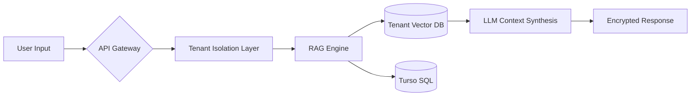

# 🛡️ Relmonition

**Relmonition** is a production-grade, multi-tenant relationship intelligence platform. It isn't just a wrapper for an LLM; it is a high-compliance system designed for secure, persistent, and private AI-driven insights.

Built for scale, Relmonition leverages a **Namespace-per-Tenant** architecture on AWS EKS to ensure that sensitive relationship data remains siloed, encrypted, and compliant with global privacy standards (GDPR/HIPAA-aligned).


-----

## Architecture

Relmonition operates on a **Three-Pillar Security Model**:

1.  **Strict Isolation:** Logic-level and infrastructure-level silos for every "couple" (tenant).
2.  **Persistent Memory:** A hierarchical RAG system (Vector + Semantic) that grows with the user.
3.  **Immutable Auditing:** All compliance-related events are piped to S3 WORM (Write Once, Read Many) storage.

### Diagram 1: Infrastructure & CI/CD Topology


### Diagram 2: Tenant Data Flow & Auth Lifecycle


### Data Flow & Memory



-----

## Tech Stack

### **Frontend & UX**

  * **Next.js 14 (App Router)** - Server-side rendering for SEO and performance.
  * **React Context API** - Lightweight, reactive state management for Auth.
  * **Performance Target:** Optimized for **INP ≤ 200ms** and **LCP ≤ 2.5s**.

### **Backend & Intelligence**

  * **Node.js / Express (TypeScript)** - Type-safe, modular service architecture.
  * **Drizzle ORM** - Edge-compatible, type-safe SQL interactions with **Turso**.
  * **RAG Engine** - Advanced retrieval using Pinecone for long-term episodic memory.

### **Cloud & DevOps**

  * **AWS EKS** - Managed Kubernetes for high-availability compute.
  * **Terraform** - Full Infrastructure as Code (IaC) for reproducible environments.
  * **AWS KMS** - Envelope encryption for data at rest.

-----

##  Project Structure

```bash
Relmonition/
├── server/             # Express + TS (The Brain)
│   ├── services/       # RAG Engine, Compliance Logic, AI Routing
│   ├── db/             # Drizzle Schemas & Turso Migrations
│   └── controllers/    # Tenant-aware API handlers
├── src/                # Next.js Frontend (The Face)
│   ├── app/            # Dashboard, Coach UI, Auth
│   └── context/        # Multi-tenant Auth State
├── terraform/          # Infrastructure (The Skeleton)
│   ├── vpc.tf          # Network Isolation
│   └── eks.tf          # Cluster Config
└── k8s/                # Manifests (The Muscle)
    └── namespaces/     # Per-tenant Resource Silos
```

-----

##  Security & Compliance

Relmonition treats privacy as a first-class citizen, not an afterthought.

| Layer | Strategy | Implementation |
| :--- | :--- | :--- |
| **Compute** | Namespace Isolation | K8s NetworkPolicies prevent cross-tenant traffic |
| **Database** | Logical Silos | Dedicated Turso DB per tenant |
| **Encryption** | AES-256 / TLS 1.3 | AWS KMS + Automatic Certificate Management |
| **Compliance** | Right to be Forgotten | Automated purging of S3, Vector, and SQL data |

-----

##  Infrastructure & Deployment

### **Prerequisites**

  * Terraform ≥ 1.5
  * AWS CLI (configured with IAM roles for EKS)
  * kubectl

### **Initialization**

```bash
# Provision Infrastructure
cd terraform
terraform init
terraform apply -var="region=us-east-1"

# Configure Kubectl
aws eks update-kubeconfig --name relmonition-cluster

# Deploy Core Services
kubectl apply -k k8s/overlays/production
```

-----

## 🗺️ Future Roadmap

  - [ ] **BYOK (Bring Your Own Key):** Allow enterprise tenants to manage their own KMS keys.
  - [ ] **SOC 2 Type II:** Achieving full compliance certification.
  - [ ] **Behavioral Analytics:** Real-time sentiment shift detection across conversation history.
  - [ ] **Fine-tuned Local Models:** Moving sensitive inference to specialized local LLMs to reduce API surface area.

-----

### 🛠️ about me

**Pranav Dwivedi** – [LinkedIn](https://www.linkedin.com/in/pranav-dwivedi-535658219/)

> *Relmonition is not just an app—it is the secure infrastructure for the future of relationship intelligence.*
