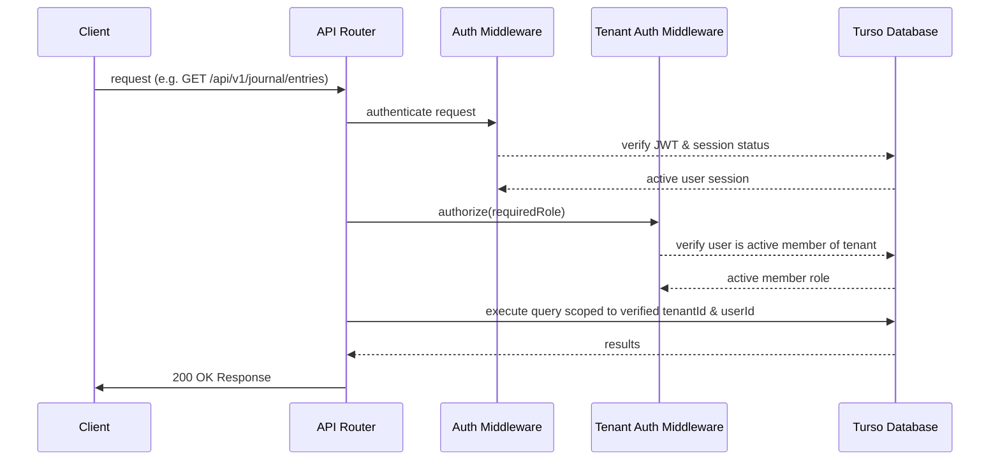

# 🛡️ Relmonition Security Remediation & Compliance Report

This report outlines the comprehensive security fixes implemented across the Relmonition application stack to eliminate critical vulnerabilities, protect multi-tenant integrity, and align the architecture with GDPR and HIPAA compliance guidelines.

---

## 1. Multi-Tenant Session Authentication & Authorization

> [!IMPORTANT]
> **Issue (Critical):** Endpoints were publicly exposed. Resource retrieval/mutation relied on client-supplied `userId` or `tenantId` parameters, representing severe **Broken Object Level Authorization (BOLA / IDOR)** vulnerabilities.

### Remediations Implemented:
1. **HttpOnly Cookie Authentication Middleware**:
   * Created [`auth.ts`](file:///run/media/pranavissam/files%20and%20data/programming/mega%20projects/Relmonition/server/src/middleware/auth.ts) to extract JWT access tokens from browser cookies.
   * Session tokens are verified against the global database sessions table to confirm active status.
2. **Tenant Membership Scoping Middleware**:
   * Created [`authorize.ts`](file:///run/media/pranavissam/files%20and%20data/programming/mega%20projects/Relmonition/server/src/middleware/authorize.ts) to query tenant memberships for the verified user.
   * Blocks requests with `403 Forbidden` if a user attempts to read/write data in a tenant they do not belong to.
3. **Safe Identity Resolution**:
   * Refactored all endpoints (Journals, Coaching Chats, RAG context, and Partner Profiles) to resolve user and tenant identities directly from the verified request context (`req.user.userId`, `req.tenantId`), completely ignoring client-forged parameters.

---

## 2. API Credentials & Key Protection at Rest

> [!WARNING]
> **Issue (High):** Bring-Your-Own-Key (BYOK) configurations stored third-party API keys (OpenAI / Gemini) in plain text inside the database, exposing them to theft in the event of database leaks.

### Remediations Implemented:
1. **AES-256-GCM Encryption Helper**:
   * Created a crypto module [`crypto.ts`](file:///run/media/pranavissam/files%20and%20data/programming/mega%20projects/Relmonition/server/src/utils/crypto.ts) leveraging Node's built-in `crypto` library.
   * Encrypts and decrypts secret strings using a derived 256-bit key from `ENCRYPTION_KEY` or `JWT_SECRET`.
2. **BYOK Encryption at Rest**:
   * Configured [`ai-config-controller.ts`](file:///run/media/pranavissam/files%20and%20data/programming/mega%20projects/Relmonition/server/src/controllers/ai-config-controller.ts) to encrypt API keys before database writes and mask them on retrieval.
   * Updated [`factory.ts`](file:///run/media/pranavissam/files%20and%20data/programming/mega%20projects/Relmonition/server/src/services/ai/providers/factory.ts) to decrypt keys on-demand during provider instantiation.

---

## 3. Hardcoded Secrets Cleanup & Local Exclusions

> [!WARNING]
> **Issue (High):** Active read-write database tokens were hardcoded inside local test scripts (`test-db.ts`) and lacked `.gitignore` tracking exclusions, raising potential risk for credential leaks in Git history.

### Remediations Implemented:
1. **Removed Database Secrets**:
   * Refactored [`test-db.ts`](file:///run/media/pranavissam/files%20and%20data/programming/mega%20projects/Relmonition/server/test-db.ts) to resolve database endpoints from environment variables (`TURSO_CONNECTION_URL` / `TURSO_AUTH_TOKEN`).
2. **Git Ignored Local Assets**:
   * Appended `test-db.ts` to [`server/.gitignore`](file:///run/media/pranavissam/files%20and%20data/programming/mega%20projects/Relmonition/server/.gitignore) to ensure development scripts are never committed.

---

## 4. Denial of Service (ZIP Bomb) Mitigation

> [!WARNING]
> **Issue (Medium):** User-uploaded zip archives for AI coaching contexts were extracted without size checks, leaving the Express thread vulnerable to memory exhaustion from Zip Bombs (DoS).

### Remediations Implemented:
1. **Pre-Decompression Size Verification**:
   * Added size checking logic in [`coach-controller.ts`](file:///run/media/pranavissam/files%20and%20data/programming/mega%20projects/Relmonition/server/src/controllers/coach-controller.ts) to check the size header of each archive item *prior* to extraction.
2. **Strict Constraints Enforced**:
   * Maximum **10MB** limit per uncompressed file.
   * Maximum **50MB** total uncompressed size limit across the entire archive.
   * Maximum **100** total files allowed within the archive.

---

## 5. Right to Be Forgotten (GDPR Compliance)

> [!WARNING]
> **Issue (Medium):** The tenant deletion hook only wiped records from primary tables (journals, mood logs), leaving sensitive user data (AI configs, health histories, coach messages, RAG fragments) orphaned.

### Remediations Implemented:
1. **Comprehensive Cascading Purges**:
   * Refactored the `deleteTursoDatabase` hook in [`tenant-manager.ts`](file:///run/media/pranavissam/files%20and%20data/programming/mega%20projects/Relmonition/server/src/tenant-manager.ts).
   * Cascades deletions across `chatUploads`, `aiProviderConfigs`, `coachConversations`, `coachMessages`, `relationshipHealthHistory`, `partnerProfiles`, and `compatibilityInsights`.
   * Ensures complete GDPR purges with zero residual data leaks.

---

## 6. HTTP Security Headers

> [!NOTE]
> **Issue (Low):** Standard HTTP response headers preventing clickjacking, MIME-type sniffing, and cross-site scripting were missing.

### Remediations Implemented:
1. **Custom Security Headers Middleware**:
   * Added response headers directly to the Express middleware pipeline inside [`index.ts`](file:///run/media/pranavissam/files%20and%20data/programming/mega%20projects/Relmonition/server/src/index.ts):
     * `X-Content-Type-Options: nosniff` (MIME-sniffing protection)
     * `X-Frame-Options: DENY` (Clickjacking prevention)
     * `X-XSS-Protection: 1; mode=block` (Reflected XSS filter)
     * `Strict-Transport-Security` (Enforced HTTPS redirection)

---

## 7. Secrets Management & Deployment Alignment

To align the new security layers with your EKS cloud infrastructure, the deployment pipeline has been updated:
* **Helm Values Configuration**: Configured [`values.yaml`](file:///run/media/pranavissam/files%20and%20data/programming/mega%20projects/Relmonition/charts/relmonition-tenant/values.yaml) and [`deployment.yaml`](file:///run/media/pranavissam/files%20and%20data/programming/mega%20projects/Relmonition/charts/relmonition-tenant/templates/deployment.yaml) to map values for `JWT_SECRET`, `ENCRYPTION_KEY`, `GEMINI_API_KEY`, and `NODE_ENV`.
* **Deployment Script**: Configured [`deploy.sh`](file:///run/media/pranavissam/files%20and%20data/programming/mega%20projects/Relmonition/deploy.sh) to forward environment secrets into Helm parameters.
* **CI/CD Actions**: Updated [`deploy-app.yml`](file:///run/media/pranavissam/files%20and%20data/programming/mega%20projects/Relmonition/.github/workflows/deploy-app.yml) to pass `JWT_SECRET` and `ENCRYPTION_KEY` securely from repository secrets.
