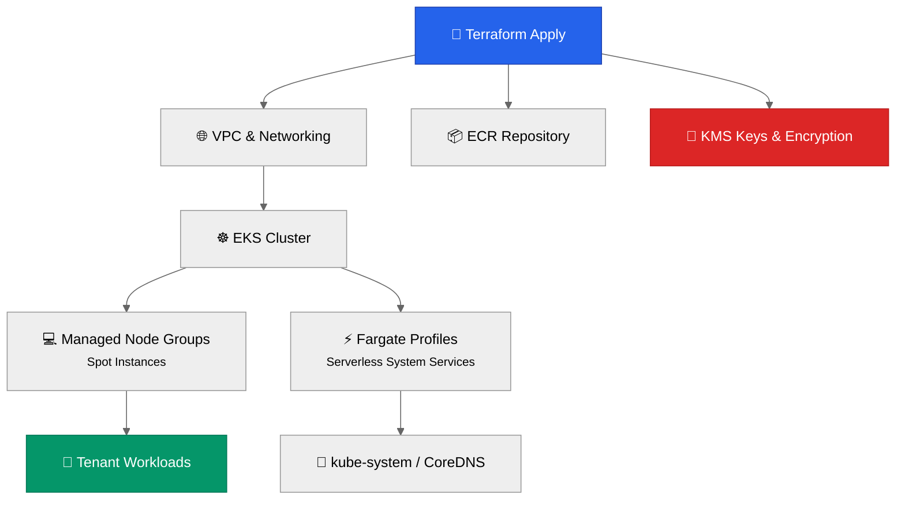
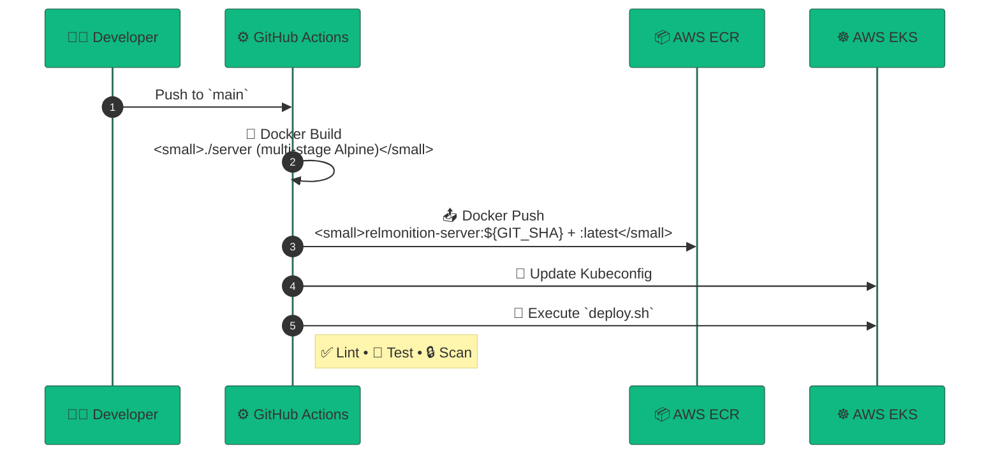
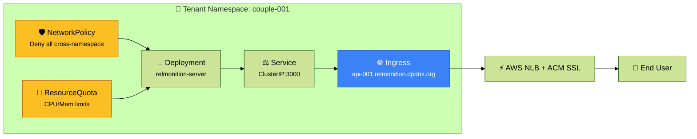
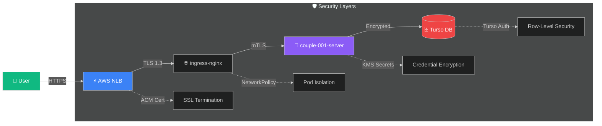

# 🚀 Relmonition Deployment Flow  
*End-to-End Infrastructure & Application Delivery Lifecycle*

> 💡 **Quick Nav**: [Phase 1](#-phase-1-infrastructure-provisioning-terraform) • [Phase 2](#-phase-2-cicd-pipeline-github-actions) • [Phase 3](#️-phase-3-per-tenant-deployment-helm) • [Security](#-security--traffic-flow) • [Commands](#-key-commands--cheatsheet)

---

## 🏗️ Phase 1: Infrastructure Provisioning (Terraform)  
*Foundation built with Terraform — focused on HA, multi-tenancy & compliance*



### 🔑 Core Components

| Component | Purpose | Key Features |
|-----------|---------|-------------|
| **VPC** | Network isolation | • Private subnets for all compute<br/>• NAT Gateway for egress<br/>• Security groups with least-privilege |
| **Compute** | Workload execution | • **Node Groups**: Spot-backed, auto-scaling for tenant pods<br/>• **Fargate**: Serverless for control-plane services |
| **Security** | Compliance & encryption | • AWS KMS for data-at-rest (HIPAA/GDPR)<br/>• IAM Roles for Service Accounts (IRSA)<br/>• Encrypted EBS & ECR |

> ⚠️ **Compliance Note**: All infrastructure resources are tagged with `compliance=hipaa-gdpr` for audit trail automation.

---

## 🤖 Phase 2: CI/CD Pipeline (GitHub Actions)  
*Automated build & deploy on every `main` branch push*



### 🔄 Pipeline Stages

```yaml
# .github/workflows/deploy.yml (simplified)
on: { push: { branches: [main] } }
jobs:
  build:
    runs-on: ubuntu-latest
    steps:
      - uses: actions/checkout@v4
      - run: docker build -t relmonition-server:${{ github.sha }} ./server
      - run: docker push $ECR_URL/relmonition-server:${{ github.sha }}
      
  deploy:
    needs: build
    runs-on: ubuntu-latest
    steps:
      - uses: aws-actions/configure-aws-credentials@v4
      - run: ./deploy.sh  # Helm-driven tenant deployment
```

> ✨ **Best Practice**: Images are immutable — tagged with full Git SHA. `:latest` is for convenience only; production uses SHA pins.

---

## ☸️ Phase 3: Per-Tenant Deployment (Helm)  
*Isolated, auditable stacks per tenant via `deploy.sh` + Helm*

### 📋 Deployment Workflow

```bash
# deploy.sh (excerpt)
COUPLE_ID="${1:-001}"
NAMESPACE="couple-${COUPLE_ID}"

# 1️⃣ Namespace with compliance labels
kubectl create namespace $NAMESPACE --dry-run=client -o yaml | \
  kubectl apply -f - && \
  kubectl label namespace $NAMESPACE \
    compliance-tier=hipaa-gdpr \
    encryption-required=true \
    tenant-id=$COUPLE_ID

# 2️⃣ Helm install with tenant values
helm upgrade --install \
  relmonition-tenant ./charts/tenant \
  --namespace $NAMESPACE \
  --set tenant.id=$COUPLE_ID \
  --set ingress.host=api-${COUPLE_ID}.relmonition.dpdns.org
```

### 🧱 Tenant Stack Architecture



### 🔒 Isolation & Governance

| Mechanism | Implementation | Benefit |
|-----------|---------------|---------|
| **Namespace** | `couple-${ID}` | Logical boundary for RBAC & auditing |
| **NetworkPolicy** | Deny ingress/egress by default | Zero-trust pod communication |
| **ResourceQuota** | `limits.cpu: 2`, `limits.memory: 4Gi` | Prevent noisy-neighbor issues |
| **Ingress + ACM** | Per-tenant subdomain + auto-SSL | Secure, branded endpoints |
| **Secrets** | K8s Secrets + KMS encryption | HIPAA-compliant credential management |

---

## 🔐 Security & Traffic Flow  
*End-to-end encrypted, zero-trust request path*



### 🔁 Request Lifecycle
1. **🌐 Entry**: User hits `https://api-001.relmonition.dpdns.org`
2. **🔓 TLS Termination**: NLB decrypts using ACM-managed cert
3. **🧭 Routing**: `ingress-nginx` matches host → routes to `couple-001-server:3000`
4. **⚙️ Processing**: Node.js app runs in isolated namespace with resource limits
5. **🗄️ Data Access**: App connects to Turso via K8s Secret (KMS-encrypted at rest)
6. **🔐 Response**: Traffic re-encrypted in transit; audit logs shipped to CloudWatch

> ✅ **Compliance Checklist**:  
> - [x] Data encrypted in transit (TLS 1.3) & at rest (KMS)  
> - [x] Pod network isolation via Kubernetes NetworkPolicy  
> - [x] Secrets never logged; rotated via external-secrets operator  
> - [x] All actions audited via CloudTrail + Kubernetes audit logs  

---

## 🛠️ Key Commands & Cheatsheet

### 🏗️ Infrastructure
```bash
# Initialize & apply Terraform
cd terraform
terraform init -upgrade
terraform plan -out=tfplan
terraform apply tfplan  # ✅ Review before applying!
```

### 👥 Tenant Management
```bash
# Deploy new tenant (ID must be 3-digit)
COUPLE_ID=001 ./deploy.sh

# Verify deployment
kubectl get all -n couple-001
kubectl describe networkpolicy -n couple-001
kubectl get ingress -n couple-001 -o wide

# Debug
kubectl logs -l app=relmonition -n couple-001 --tail=100
kubectl exec -it -n couple-001 deploy/relmonition-server -- sh
```

### 🔍 Monitoring & Audit
```bash
# Check compliance labels
kubectl get ns -L compliance-tier,encryption-required

# View resource usage per tenant
kubectl top pods -n couple-001
kubectl describe resourcequota -n couple-001

# Audit trail
aws cloudtrail lookup-events \
  --lookup-attributes AttributeKey=EventName,AttributeValue=CreateNamespace \
  --start-time $(date -d '1 hour ago' -Iseconds)
```

### 🧹 Cleanup (⚠️ Destructive)
```bash
# Delete tenant (irreversible!)
kubectl delete namespace couple-001
# → Triggers cascading delete: pods, services, ingress, secrets

# Full infra teardown (use with extreme caution)
cd terraform && terraform destroy -auto-approve
```

> ⚠️ **Warning**: Always backup tenant data before namespace deletion. Turso databases are external and require manual cleanup.

---

## 📎 Appendix: Quick Reference

| Resource | Pattern | Example |
|----------|---------|---------|
| **Namespace** | `couple-XXX` | `couple-042` |
| **Subdomain** | `api-XXX.relmonition.dpdns.org` | `api-042.relmonition.dpdns.org` |
| **ECR Tag** | `relmonition-server:<GIT_SHA>` | `relmonition-server:a1b2c3d` |
| **Helm Release** | `relmonition-tenant` | (per-namespace) |
| **Compliance Label** | `compliance-tier=hipaa-gdpr` | Applied to all tenant namespaces |

---

> 🌟 **Pro Tip**: Use `kubectl ctx` + `kubectl ns` (from [kubectx](https://github.com/ahmetb/kubectx)) to switch contexts/namespaces faster during tenant ops.

*Document Version: 2.1 • Last Updated: May 2026 • Owner: Platform Engineering*  
*🔐 This document contains infrastructure details — handle per security policy SEC-DOC-003*